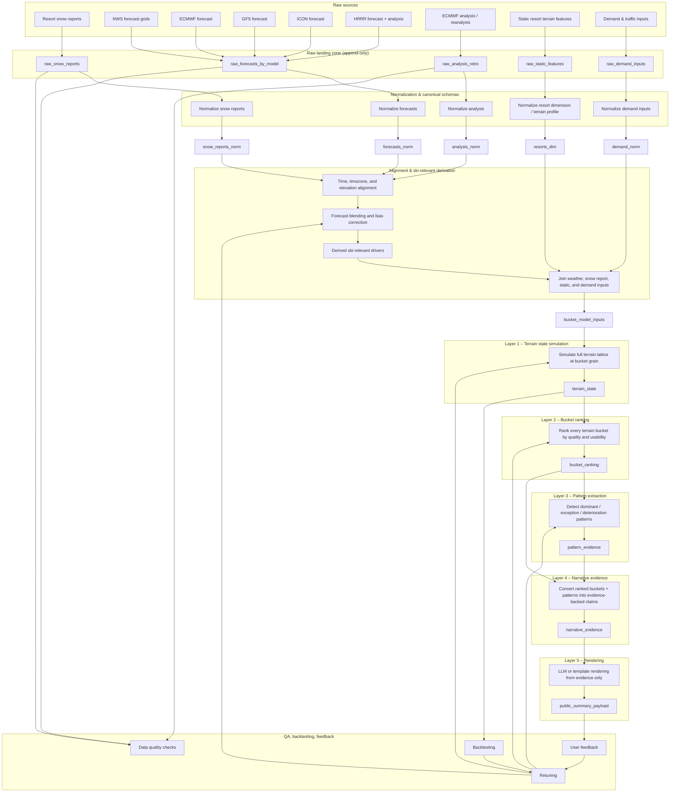

# Snow Intel – Data Architecture & Modeling Pipeline

This repository documents the end-to-end data architecture behind **Snow Intel**:  
how raw weather, snow report, terrain, and demand data flow through normalization,  
terrain-bucket simulation, ranking, pattern extraction, and ultimately into skier-facing summaries.

The goal of this system is not to predict weather in isolation, but to translate  
weather uncertainty into **skiable conditions and constraints** that reflect terrain, exposure, durability, crowding, and real-world resort behavior.

At its core, Snow Intel is a **bucket-first inference system**.

It does not begin with mountain-wide summaries or aspect-level narratives.  
Instead, it simulates the full terrain lattice, ranks every terrain bucket, identifies  
patterns across the best and worst buckets, converts those patterns into explicit  
evidence-backed claims, and only then renders skier-facing language.

---

## High-level system flow

---

## Core modeling principle

Snow Intel is built around a **full terrain lattice**, not a resort-wide average.

### Canonical grain

- `resort_id`
- `timestamp_local`
- `terrain_type`
- `aspect`
- `elevation_band`

### Key rules

- All terrain buckets must be simulated (no early pruning)
- State is path-dependent (prior conditions influence current state)
- No aggregation or narrative logic at this layer

This terrain-state layer is the ground truth for all downstream logic.

---

## Layer 1 – Terrain state simulation

Simulates the condition of every terrain bucket through time.

### Example fields

- `surface_family`
- `supportability_score`
- `edgeability_score`
- `softness_score`
- `moisture_score`
- `ski_quality_score`
- `is_in_play_flag`
- `degradation_risk_score`
- `trend_score`
- `solar_load_score`
- `wind_effect_score`
- `crowd_effect_score`
- `prior_surface_family`
- `transition_reason`

No narrative logic exists at this layer.

---

## Layer 2 – Bucket ranking

Ranks every terrain bucket without aggregation.

### Principles

- No aspect-level summaries
- No terrain-type grouping
- Ranking happens at full bucket granularity

### Outputs

- `quality_rank_overall`
- `quality_score`
- `coverage_weight`
- `durability_score`
- `time_decay_risk`
- `actionability_flag`
- `composite_rank_score`

---

## Layer 3 – Pattern extraction

Identifies patterns across top and bottom ranked buckets.

### Examples

- Dominant skiable zones  
- Exceptions  
- Deterioration patterns  
- Separation between good and bad terrain  

### Operations

- Identify top/bottom N buckets  
- Cluster by shared attributes  
- Measure support fraction and terrain coverage  
- Detect divergence between strong and weak terrain  

---

## Layer 4 – Narrative evidence

Converts ranked outcomes into explicit, evidence-backed claims.

### Evidence types

- `dominant_story`
- `secondary_pattern`
- `deterioration_pattern`
- `least_bad_option`
- `dead_zone`
- `timing_shift`

### Fields

- `claim_text_seed`
- `evidence_type`
- `support_fraction`
- `coverage_fraction`
- `confidence_score`
- `actionable_flag`
- `suppression_flag`
- `reason_codes`

All claims must be supported by bucket-level evidence.

---

## Layer 5 – Rendering

Transforms narrative evidence into skier-facing output.

### Constraints

- Does not recompute rankings  
- Does not introduce new relationships  
- Only expresses existing evidence clearly  

### Outputs

- `primary_story`
- `mountain_state`
- `surface_intelligence`
- `start_here`
- `avoid_this`
- `day_evolution`

---

## What this architecture optimizes for

Snow Intel is designed to answer:

> **Where should I ski, what should I avoid, what will change, and why?**

### System priorities

- Terrain granularity  
- Path dependence  
- Operational realism  
- Timing sensitivity  
- Evidence-backed summaries  

The system reasons **from terrain upward**, not from summaries downward.
